# Claude Code — Software Stack & Architecture

> **Version:** 2.1.88  
> **Package:** `@anthropic-ai/claude-code`  
> **Runtime:** Node.js ≥ 18, bundled with Bun

---

## Table of Contents

1. [Software Stack Overview](#1-software-stack-overview)
2. [Top-Level Component Diagram](#2-top-level-component-diagram)
3. [Top-Level Sequence Diagram — Interactive Session](#3-top-level-sequence-diagram--interactive-session)
4. [Module: CLI Entry & Bootstrap](#4-module-cli-entry--bootstrap)
5. [Module: Terminal UI (Ink / React)](#5-module-terminal-ui-ink--react)
6. [Module: Query Engine](#6-module-query-engine)
7. [Module: Tools System](#7-module-tools-system)
8. [Module: State Management](#8-module-state-management)
9. [Module: API Service](#9-module-api-service)
10. [Module: MCP Service](#10-module-mcp-service)
11. [Module: Session Memory & Compact](#11-module-session-memory--compact)
12. [Module: Commands (Slash Commands)](#12-module-commands-slash-commands)
13. [Module: Multi-Agent / Swarm Coordinator](#13-module-multi-agent--swarm-coordinator)
14. [Module: Analytics & Telemetry](#14-module-analytics--telemetry)

---

## 1. Software Stack Overview

| Layer | Technology | Location |
|---|---|---|
| **Runtime** | Node.js ≥ 18, ESM | `cli.js` (self-contained bundle) |
| **Build toolchain** | Bun bundler + TypeScript | `source/src/**/*.ts(x)` |
| **Terminal UI** | [Ink](https://github.com/vadimdemedes/ink) (React for terminals) | `source/src/ink.ts`, `screens/`, `components/` |
| **UI framework** | React 18 (RSC-compiled via Bun React Compiler) | `source/src/components/` |
| **State management** | Custom zustand-style store | `source/src/state/` |
| **CLI argument parsing** | [Commander.js](https://github.com/tj/commander.js) | `source/src/main.tsx` |
| **AI API client** | `@anthropic-ai/sdk` (also Bedrock / Vertex via adapters) | `source/src/services/api/` |
| **Tool protocol** | [MCP – Model Context Protocol](https://modelcontextprotocol.io) | `source/src/services/mcp/` |
| **Analytics** | Internal + Datadog | `source/src/services/analytics/` |
| **Auth** | OAuth 2.0 / API key / AWS STS / GCP | `source/src/utils/auth.ts`, `services/oauth/` |
| **Image processing** | `@img/sharp` (optional, native binaries per platform) | `package.json` optionalDependencies |
| **Schema validation** | Zod v4 | `source/src/schemas/` |
| **Logging / tracing** | Internal sinks, Datadog, OpenTelemetry-style unary logging | `source/src/utils/log.ts`, `utils/telemetry/` |

### Key architectural characteristics

- **Single self-contained binary** — `cli.js` (≈13 MB) bundles all JavaScript + `node_modules`; only native add-ons (sharp) ship separately.
- **Feature flags** — `feature('FLAG_NAME')` calls at module level enable dead-code elimination at build time (Bun DCE).
- **Reactive UI** — Ink renders a virtual terminal DOM via React, enabling hooks-driven updates on every turn.
- **Pluggable tools** — Every AI capability (file edit, bash, web search, …) is a `Tool` object registered at startup.
- **MCP gateway** — External tools/resources are exposed to Claude through the Model Context Protocol.
- **Multi-agent swarm** — Teammate sub-agents can be spawned in-process or out-of-process; a Coordinator mode orchestrates them.

---

## 2. Top-Level Component Diagram

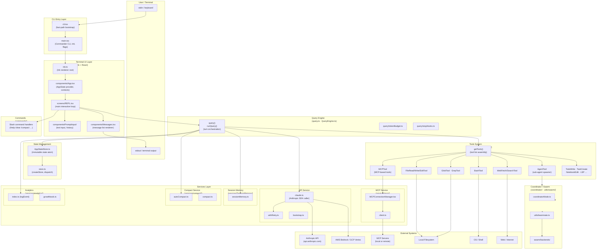

---

## 3. Top-Level Sequence Diagram — Interactive Session

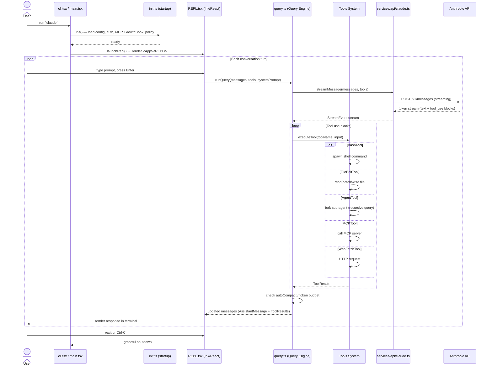

---

## 4. Module: CLI Entry & Bootstrap

### Purpose
`entrypoints/cli.tsx` is the program's true entry point. It handles fast-paths (version, MCP server modes) before loading the full `main.tsx`. `main.tsx` uses **Commander.js** to parse all flags/subcommands and calls `init()` to prepare the runtime environment.

### Component Diagram

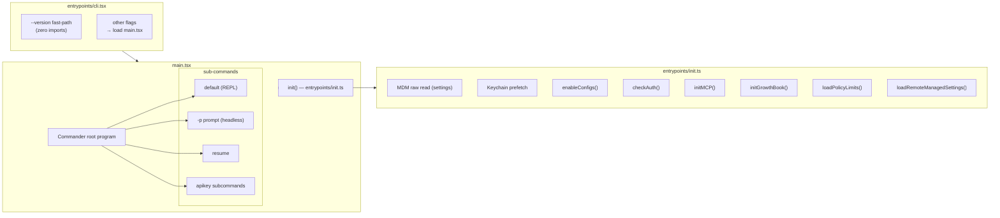

### Sequence Diagram — Startup

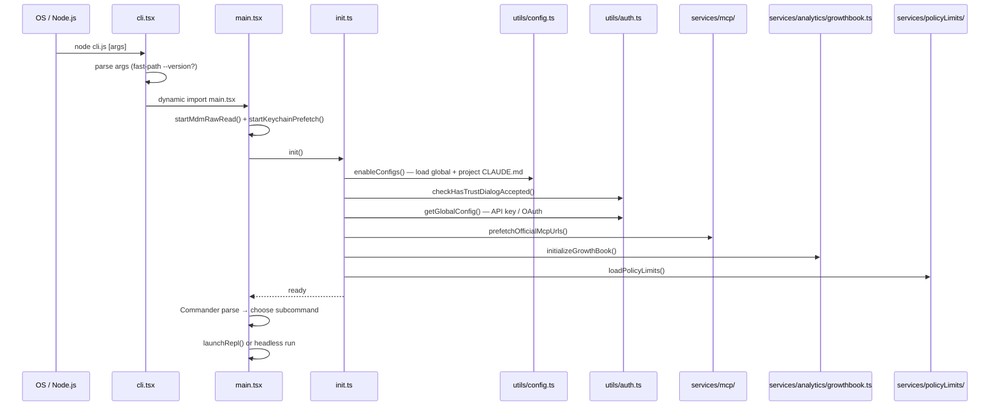

---

## 5. Module: Terminal UI (Ink / React)

### Purpose
The UI layer renders an interactive terminal application using **Ink** (a React renderer for terminals). It manages:
- The prompt input area
- The scrollable message history
- Dialogs (permissions, settings, onboarding, MCP approval, …)
- Status line (model, cost, connection)

### Component Diagram

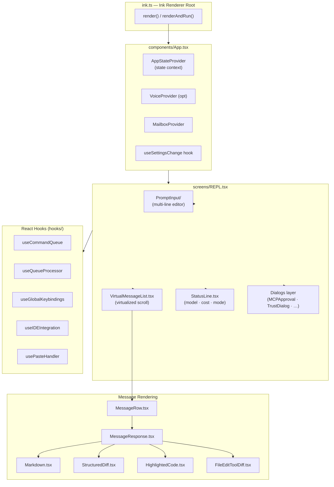

### Sequence Diagram — User Input → Render

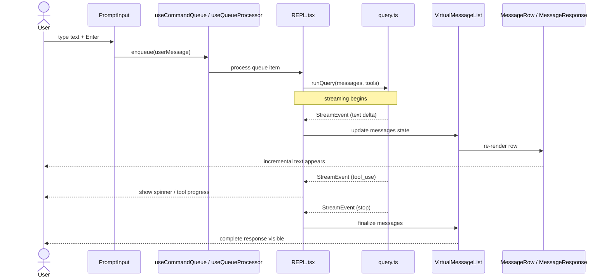

---

## 6. Module: Query Engine

### Purpose
`query.ts` / `QueryEngine.ts` is the **core conversation loop**. For each user turn it:
1. Prepends system context + memory attachments
2. Calls the Anthropic API with streaming
3. Executes tool calls in the response
4. Appends tool results and recurses (multi-turn tool use)
5. Manages token budget, auto-compact, and stop hooks

### Component Diagram

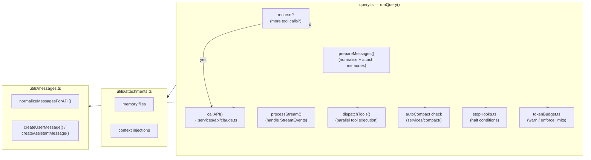

### Sequence Diagram — Multi-Turn Tool Use

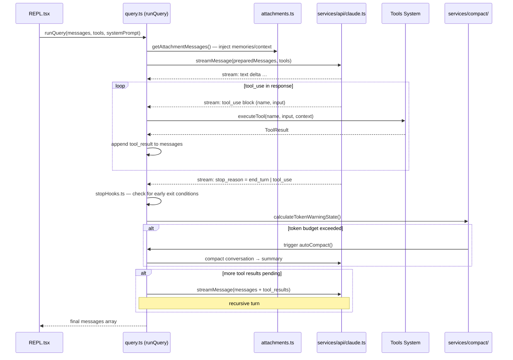

---

## 7. Module: Tools System

### Purpose
Every capability Claude can invoke is a **`Tool`** object defined in `Tool.ts`. `tools.ts` assembles the active tool list based on feature flags and user context. Tools are split between:
- **Built-in tools** (shipped with Claude Code)
- **MCP tools** (dynamically from MCP servers)

### Component Diagram

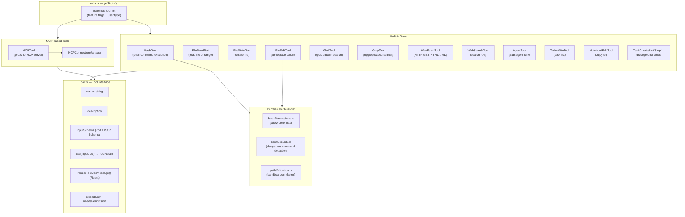

### Sequence Diagram — Tool Execution (BashTool example)

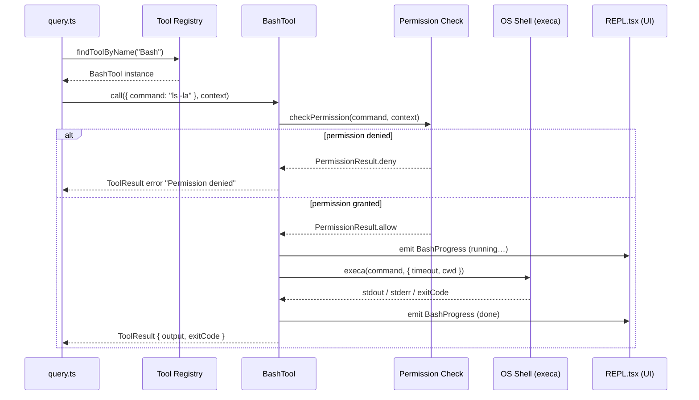

### Sequence Diagram — AgentTool (sub-agent fork)

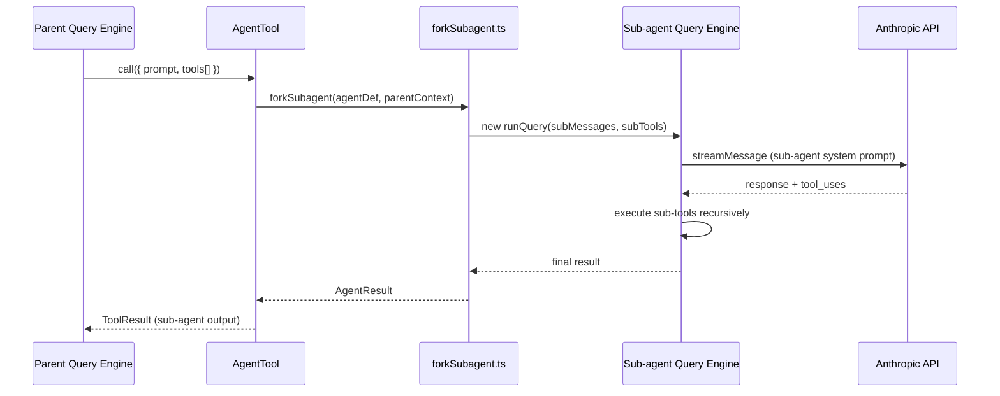

---

## 8. Module: State Management

### Purpose
`state/` implements a minimal **reactive state store** (similar to Zustand) wrapping React's `useSyncExternalStore`. `AppState` is an immutable snapshot; mutations go through `setState()`.

### Component Diagram

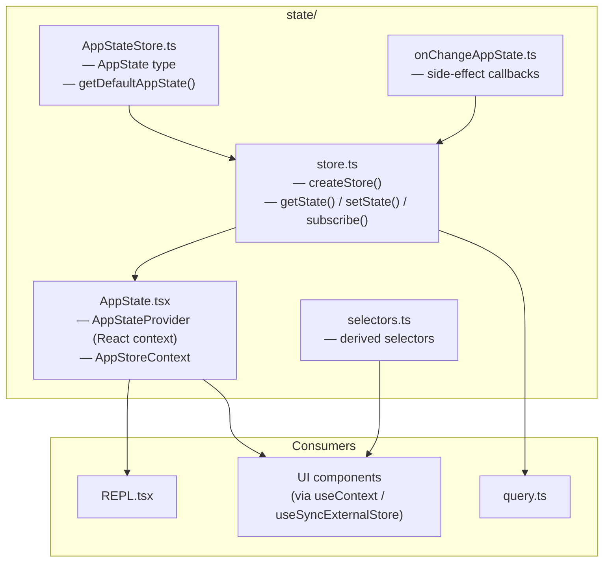

### Sequence Diagram — State Update

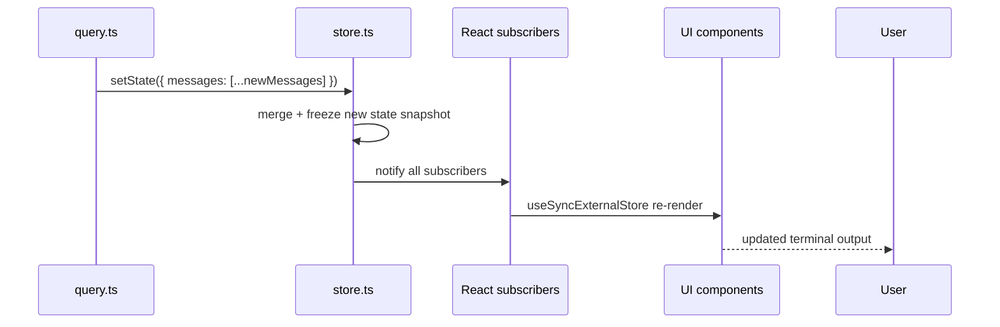

---

## 9. Module: API Service

### Purpose
`services/api/` wraps the **Anthropic SDK** (and Bedrock/Vertex adapters). Key responsibilities:
- Building the API request (model, messages, tools, betas, cache headers)
- Streaming token-by-token
- Retry logic with back-off
- Cost / token tracking
- Error normalisation

### Component Diagram

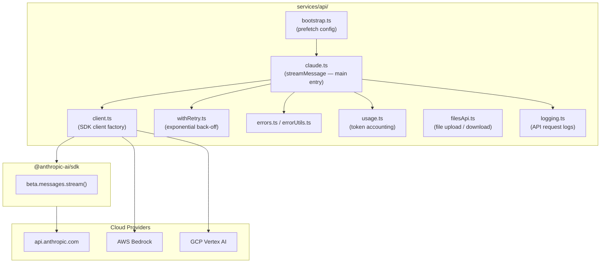

### Sequence Diagram — Stream API Call

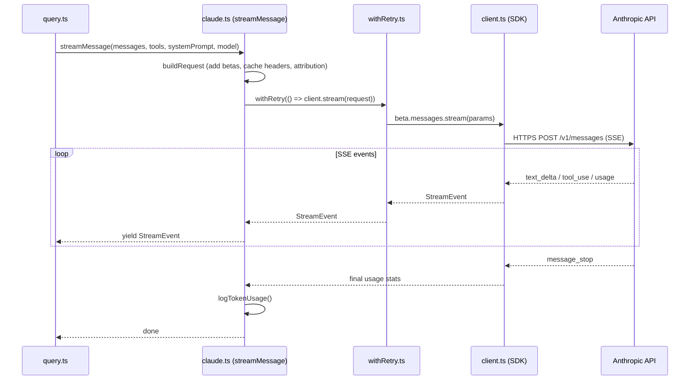

---

## 10. Module: MCP Service

### Purpose
`services/mcp/` manages **Model Context Protocol** server connections. It:
- Discovers servers from config (local, remote, VS Code SDK)
- Maintains persistent connections (stdio / SSE / WebSocket)
- Exposes MCP tools and resources to Claude
- Handles OAuth for remote MCP servers

### Component Diagram

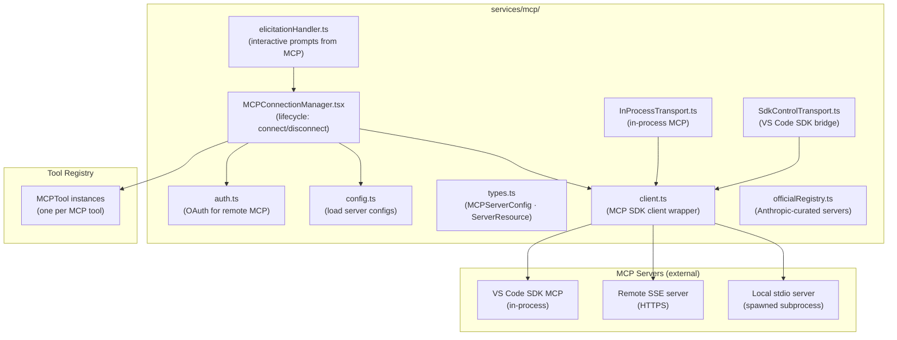

### Sequence Diagram — MCP Tool Call

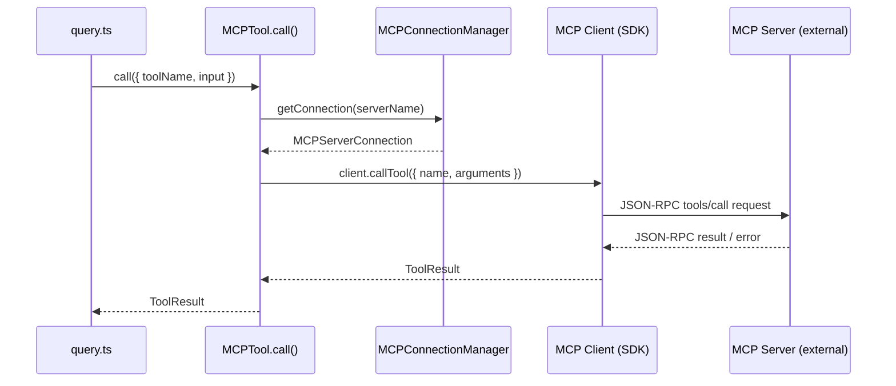

---

## 11. Module: Session Memory & Compact

### Purpose

**Session Memory** (`services/SessionMemory/`) persists facts learned during a session into `~/.claude/memory/` files, which are injected as attachments on subsequent turns.

**Compact** (`services/compact/`) manages the context window: when the conversation approaches the token limit it either auto-compacts (summarises older turns) or warns the user.

### Component Diagram

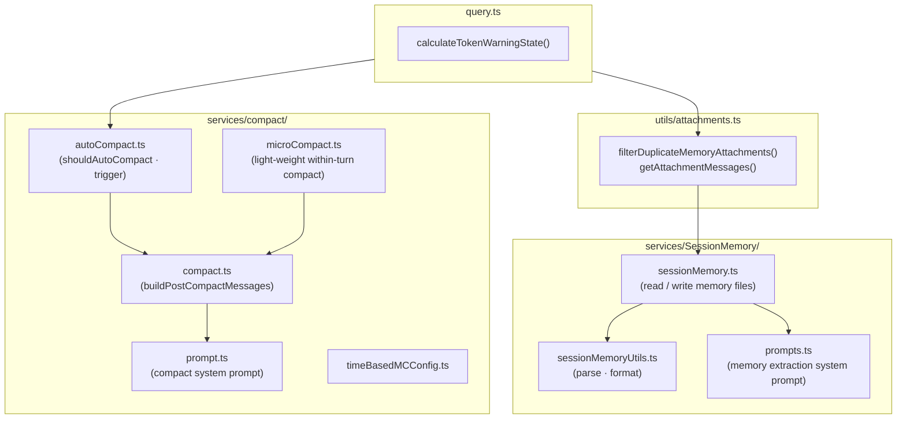

### Sequence Diagram — Auto-Compact

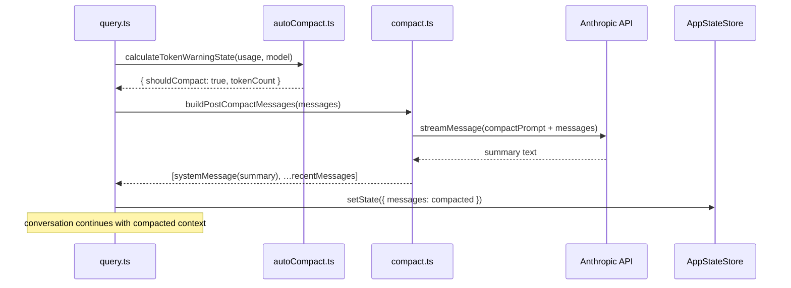

---

## 12. Module: Commands (Slash Commands)

### Purpose
`commands/` contains handlers for every **slash command** (`/help`, `/clear`, `/compact`, `/memory`, `/mcp`, `/model`, `/permissions`, …). Each command is a `Command` object with a `handler` function and optional React UI.

### Component Diagram

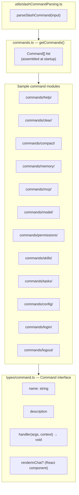

### Sequence Diagram — Slash Command Execution

```mermaid
sequenceDiagram
    actor User
    participant PI as PromptInput
    participant Parser as slashCommandParsing.ts
    participant Registry as commands.ts
    participant CmdHandler as Command.handler()
    participant UI as REPL.tsx

    User->>PI: type "/compact" + Enter
    PI->>Parser: parseSlashCommand("/compact")
    Parser-->>PI: { name: "compact", args: [] }
    PI->>Registry: findCommand("compact")
    Registry-->>PI: CompactCommand
    PI->>CmdHandler: handler(args, context)
    CmdHandler->>UI: dispatch compact action
    UI-->>User: show compact progress
```

---

## 13. Module: Multi-Agent / Swarm Coordinator

### Purpose
Claude Code supports **multi-agent workflows** via the Swarm system. The coordinator (`coordinator/coordinatorMode.ts`) orchestrates a team of Teammate agents. Each agent runs its own query loop and communicates via mailbox messages.

### Component Diagram

```mermaid
graph TB
    subgraph CoordModule["coordinator/"]
        CoordMode["coordinatorMode.ts\n(orchestrate team)"]
    end

    subgraph SwarmUtils["utils/swarm/"]
        Backends["backends/\n(in-process · remote)"]
        InProcessRunner["inProcessRunner.ts"]
        SpawnUtils["spawnUtils.ts"]
        TeamHelpers["teamHelpers.ts"]
        TeammateInit["teammateInit.ts"]
        LayoutMgr["teammateLayoutManager.ts"]
        PermSync["permissionSync.ts"]
        LeaderBridge["leaderPermissionBridge.ts"]
    end

    subgraph TeammateUtils["utils/teammate.ts"]
        TmUtils["teammate lifecycle\n(create · connect · shutdown)"]
    end

    subgraph AgentTool["tools/AgentTool/"]
        Fork["forkSubagent.ts"]
        RunAgent["runAgent.ts"]
        Resume["resumeAgent.ts"]
    end

    subgraph Mailbox["context/mailbox.ts"]
        MailboxProv["MailboxProvider\n(message queue between agents)"]
    end

    CoordMode --> TeammateUtils
    TeammateUtils --> SwarmUtils
    SwarmUtils --> Backends
    Backends --> InProcessRunner
    InProcessRunner --> Fork
    Fork --> RunAgent
    AgentTool --> RunAgent
    RunAgent --> Mailbox
    PermSync --> LeaderBridge
```

### Sequence Diagram — Coordinator spawning Teammates

```mermaid
sequenceDiagram
    participant User
    participant Coord as coordinatorMode.ts
    participant TmUtils as utils/teammate.ts
    participant TmInit as swarm/teammateInit.ts
    participant TmAgent as Teammate Query Loop
    participant Mailbox as Mailbox (message bus)
    participant API as Anthropic API

    User->>Coord: start coordinator session
    Coord->>TmUtils: createTeammates(agentDefs)

    loop for each Teammate
        TmUtils->>TmInit: initTeammate(agentDef)
        TmInit->>TmAgent: spawn sub-process / in-process agent
        TmAgent->>Mailbox: subscribe(agentId)
    end

    Coord->>Mailbox: send task message to Teammate A
    Mailbox->>TmAgent: deliver message
    TmAgent->>API: streamMessage (agent turn)
    API-->>TmAgent: response
    TmAgent->>Mailbox: send result to Coordinator
    Mailbox->>Coord: deliver result
    Coord-->>User: aggregated output
```

---

## 14. Module: Analytics & Telemetry

### Purpose
`services/analytics/` provides an event-logging pipeline. Events are logged via `logEvent()` and routed to one or more **sinks** (Datadog, internal first-party endpoint, GrowthBook). Feature flags use GrowthBook for A/B experiments.

### Component Diagram

```mermaid
graph TB
    subgraph Analytics["services/analytics/"]
        LogEvent["index.ts — logEvent(eventName, metadata)"]
        Sink["sink.ts — EventSink interface"]
        Datadog["datadog.ts — DatadogSink"]
        FirstParty["firstPartyEventLogger.ts\n(internal endpoint)"]
        GrowthBook["growthbook.ts\n(feature flags · A/B)"]
        Metadata["metadata.ts\n(session · user context)"]
        SinkKill["sinkKillswitch.ts"]
    end

    subgraph Callers["Callers (throughout codebase)"]
        QE["query.ts"]
        Tools["tools/BashTool/ …"]
        Commands["commands/"]
        UI["components/"]
    end

    Callers --> LogEvent
    LogEvent --> Sink
    Sink --> Datadog
    Sink --> FirstParty
    LogEvent --> GrowthBook
    LogEvent --> Metadata
    Sink --> SinkKill
```

### Sequence Diagram — Event Logging

```mermaid
sequenceDiagram
    participant Tool as BashTool (example)
    participant LE as logEvent()
    participant Meta as metadata.ts
    participant Sink as EventSink(s)
    participant DD as Datadog
    participant FP as First-Party Endpoint

    Tool->>LE: logEvent("bash_execute", { exitCode, duration })
    LE->>Meta: enrich(sessionId, userId, model, …)
    Meta-->>LE: enriched event
    LE->>Sink: emit(enrichedEvent)
    Sink->>DD: POST metrics/events (async, batched)
    Sink->>FP: POST internal endpoint (async, batched)
```

---

## Appendix: Directory Quick-Reference

```
source/src/
├── entrypoints/          # cli.tsx (entry), init.ts (startup), mcp.ts, sdk/
├── main.tsx              # Commander CLI, flag parsing, launchRepl()
├── query.ts              # Core conversation loop (runQuery)
├── QueryEngine.ts        # QueryEngine class (wraps query.ts)
├── Tool.ts               # Tool interface + helpers
├── tools.ts              # getTools() — assembles tool list
├── tools/                # Individual tool implementations
│   ├── BashTool/         # Shell command execution
│   ├── FileReadTool/     # Read files
│   ├── FileWriteTool/    # Write/create files
│   ├── FileEditTool/     # Str-replace patch editing
│   ├── GlobTool/         # Glob pattern matching
│   ├── GrepTool/         # Ripgrep-based search
│   ├── AgentTool/        # Sub-agent fork & run
│   ├── WebFetchTool/     # HTTP fetch + HTML→Markdown
│   ├── WebSearchTool/    # Web search API
│   ├── MCPTool/          # Proxy to MCP server tool
│   ├── TodoWriteTool/    # Task/todo list management
│   ├── TaskCreateTool/   # Background task creation
│   └── NotebookEditTool/ # Jupyter notebook editing
├── state/                # AppState store (zustand-style)
├── components/           # React/Ink UI components
├── screens/              # Top-level screens (REPL, Doctor, Resume)
├── hooks/                # React hooks
├── commands/             # Slash command handlers
├── services/
│   ├── api/              # Anthropic SDK client, retry, usage
│   ├── mcp/              # MCP connection manager
│   ├── compact/          # Context window management
│   ├── SessionMemory/    # Persistent memory files
│   ├── analytics/        # Event logging, GrowthBook
│   ├── oauth/            # OAuth 2.0 flows
│   └── lsp/              # Language Server Protocol integration
├── coordinator/          # Multi-agent coordinator mode
├── utils/
│   ├── auth.ts           # Auth logic (API key, OAuth, Bedrock, Vertex)
│   ├── config.ts         # Global + project config (CLAUDE.md)
│   ├── git.ts            # Git helpers
│   ├── permissions/      # Tool permission framework
│   ├── swarm/            # Teammate / swarm helpers
│   ├── model/            # Model selection, cost
│   ├── settings/         # MDM, remote managed settings
│   └── memory/           # Memory file utilities
├── constants/            # Prompts, product config, OAuth scopes
└── types/                # Shared TypeScript types
```
